# Forever E-commerce Website

Forever is a full-featured e-commerce platform built using the MERN stack and styled with Tailwind CSS. It includes a customer-facing frontend, an admin panel for managing the store, and a backend to handle data and API requests.

## Features

- **Frontend:**

  - Responsive and clean UI for browsing products.
  - User authentication (Login, Register).
  - Product search, filter, and sorting options.
  - Shopping cart functionality.
  - Checkout process with order summary and payment integration.

- **Admin Panel:**

  - Dashboard for managing products, orders, and users.
  - Add, edit, and delete products.
  - View customer orders and manage order status.

- **Backend:**
  - RESTful API for data management (products, users, orders).
  - Secure authentication using JWT.
  - Integration with MongoDB for database storage.

## Tech Stack

- **Frontend:** React, Tailwind CSS
- **Backend:** Node.js, Express.js
- **Database:** MongoDB
- **Authentication:** JWT
- **Deployment:** Vercel

## Installation

1. Clone the repository:
   ```bash
   git clone https://github.com/Imtiaz4530/Forever
   ```
2. Install dependencies for the frontend:

   ```bash
   cd frontend
   npm install
   ```

3. Install dependencies for the backend:

   ```bash
   cd backend
   npm install
   ```

4. Add a `.env` file for environment variables in the frontend, admin and backend directory, including the following:

   ## Frontend & admin

   ```
   VITE_BACKEND_URL =<Your Backend URL>
   ```

   ## Backend

   ```
   MONGODB_URI=<Your MongoDB URI>
   JWT_SECRET=<Your JWT Secret>
   CLOUDINARY_API_KEY  = <Your Cloudinary API Key>
   CLOUDINARY_SECRET_KEY = <Your Cloudinary Secret key>
   CLOUDINARY_NAME = <Your Cloudinary Name>
   ADMIN_EMAIL = <Your MongoDB URI>
   ADMIN_PASSWORD = <Your Admin password>
   STRIPE_SECRET_KEY = <Your Stripe Secret>
   ```

````

5. Run both frontend and backend:
```bash
npm run dev
````

## Contributing

Feel free to open issues or submit pull requests to contribute to this project!

## Screenshots

### FRONTEND

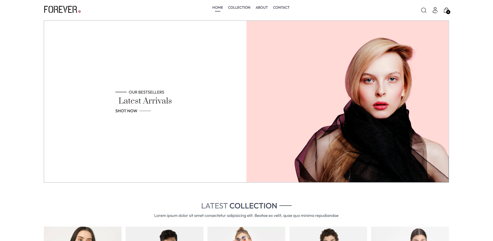
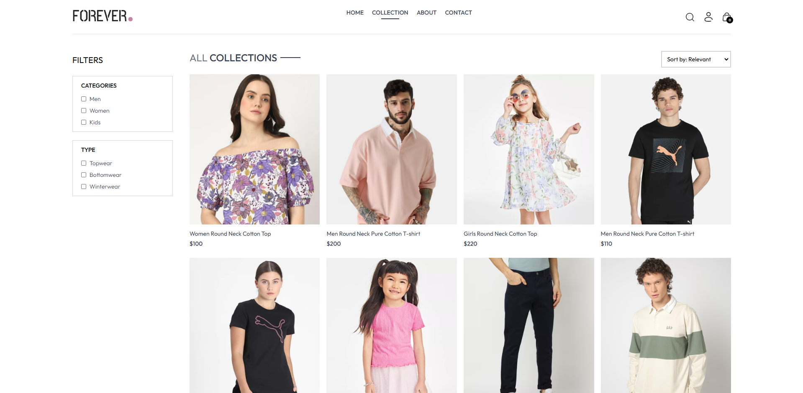
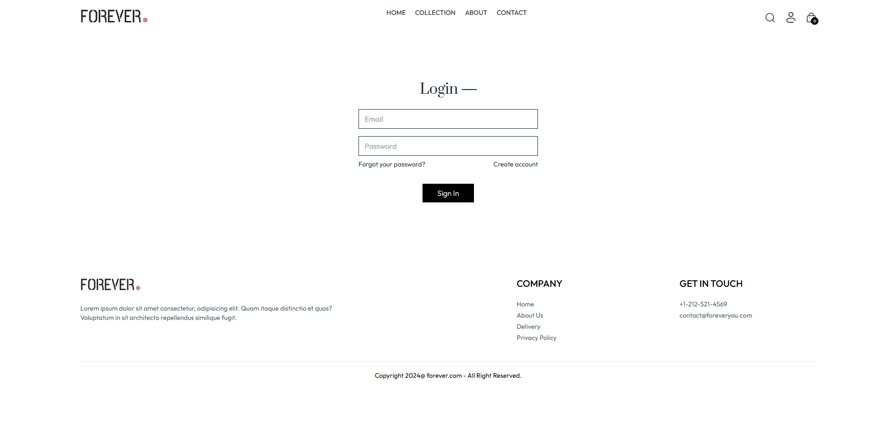
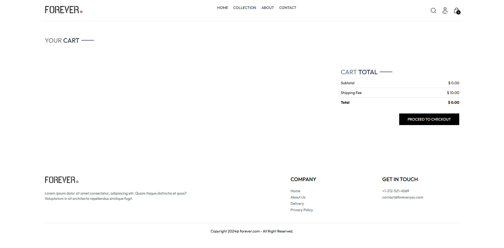
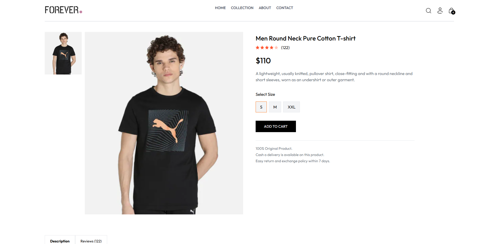
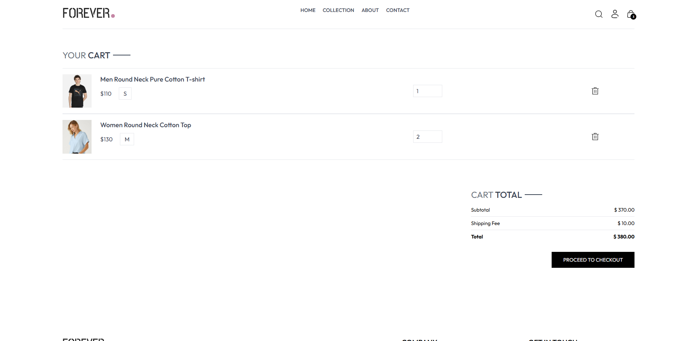
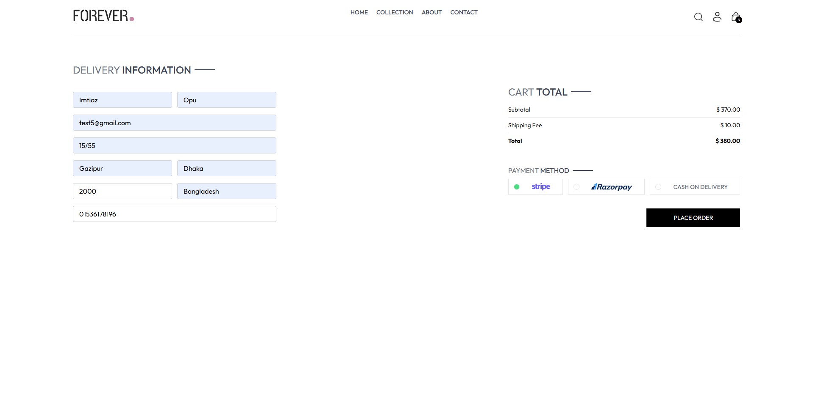
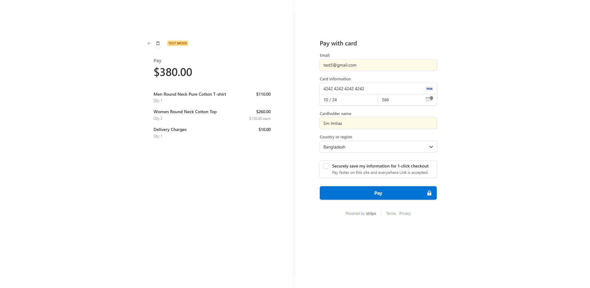
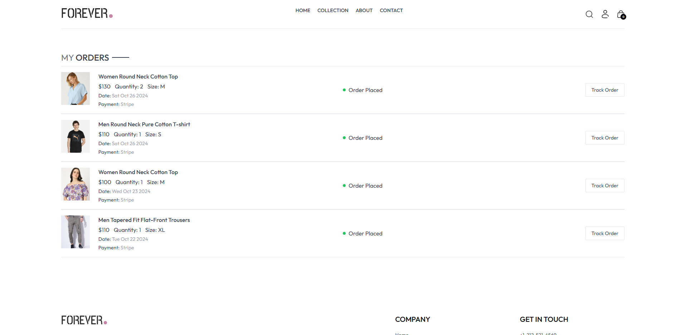

### Admin Dashboard

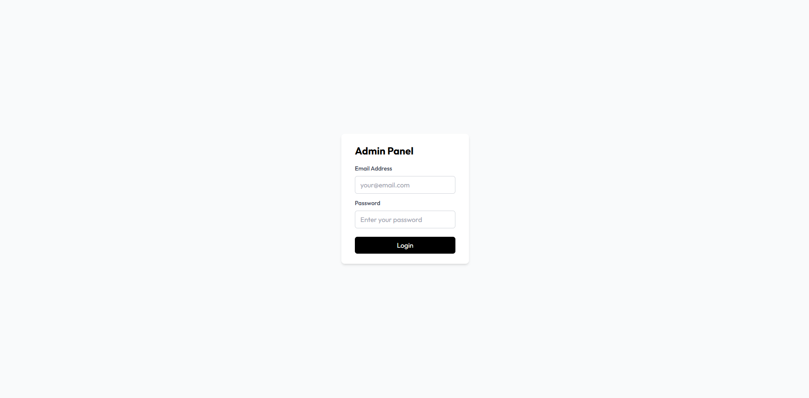
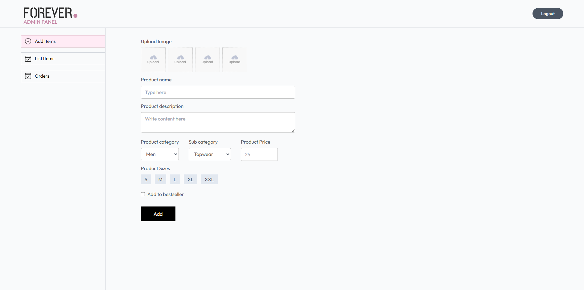
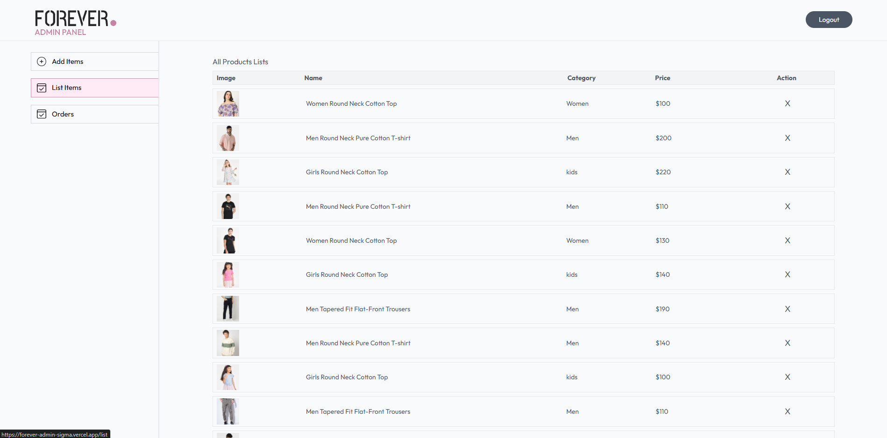
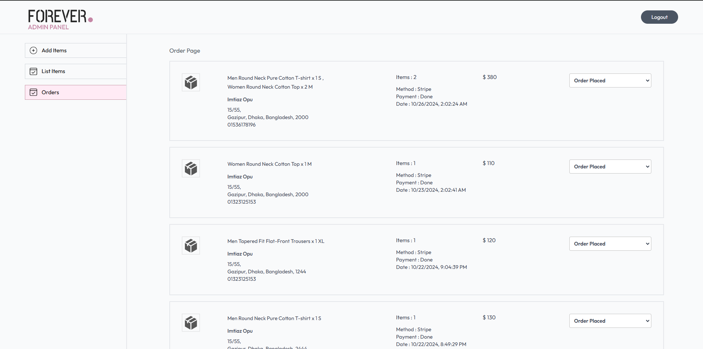
